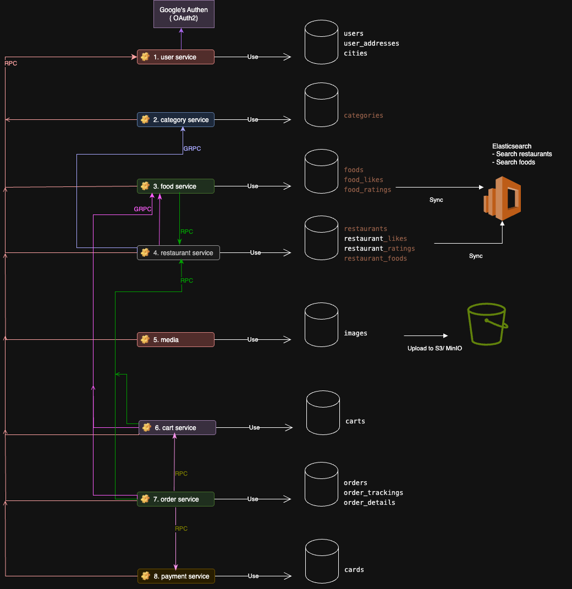

# Go Food Delivery Backend Service

A comprehensive food delivery backend service built with Go, following hexagonal architecture principles and designed for microservices deployment.

Main features

- **User Service**: Authentication, registration, profile management
- **Restaurant Service**: Restaurant listings, menu management
- **Food Service**: Food items, categories, inventory
- **Cart Service**: Shopping cart operations
- **Order Service**: Order processing and *tracking (TBD)*
- **Media Service**: File upload and media management
- **Payment Service**: *Payment processing and verification (TBD)*
- **Real-time delivery tracking** *(TBD)*



## 🏗️ Project Structure

```text
├── main.go                 # Application entry point
├── app                     # Compiled binary executable
├── cmd/                   # CLI commands (Cobra)
│   ├── root.go           # Root command with HTTP & gRPC servers
│   └── consumer_order.go # Order consumer command
├── middleware/             # HTTP middleware (auth, recovery, provider)
│   ├── auth.go           # Authentication middleware
│   ├── provider.go       # Provider middleware
│   └── recover.go        # Recovery middleware
├── modules/               # Business modules (hexagonal architecture)
│   ├── user/             # User management & authentication
│   │   ├── infras/       # Infrastructure layer
│   │   │   ├── controller/http-gin/  # HTTP controllers
│   │   │   └── repository/gorm-mysql/ # Data repositories
│   │   ├── model/        # Domain models (user.go, user_address.go, error.go)
│   │   ├── service/      # Business logic (auth, CRUD, verification)
│   │   └── module.go     # Module setup
│   ├── restaurant/       # Restaurant operations
│   │   ├── infras/       # Infrastructure layer
│   │   ├── model/        # Restaurant domain models
│   │   ├── service/      # Restaurant business logic
│   │   └── module.go     # Module setup
│   ├── food/            # Food items & categories
│   │   ├── infras/       # Infrastructure layer
│   │   ├── model/        # Food domain models
│   │   ├── service/      # Food business logic
│   │   └── module.go     # Module setup
│   ├── cart/            # Shopping cart
│   │   ├── infras/       # Infrastructure layer
│   │   ├── model/        # Cart domain models
│   │   ├── service/      # Cart business logic
│   │   └── module.go     # Module setup
│   ├── order/           # Order processing
│   │   ├── infras/       # Infrastructure layer
│   │   ├── model/        # Order domain models
│   │   ├── service/      # Order business logic
│   │   └── module.go     # Module setup
│   ├── payment/         # Payment card management
│   │   ├── infras/       # Infrastructure layer
│   │   ├── model/        # Payment domain models
│   │   ├── service/      # Payment business logic
│   │   └── module.go     # Module setup
│   ├── media/           # Media upload
│   │   ├── infras/       # Infrastructure layer
│   │   ├── model/        # Media domain models
│   │   ├── service/      # Media business logic
│   │   └── module.go     # Module setup
│   └── category/        # Food categories
│       ├── infras/       # Infrastructure layer
│       ├── model/        # Category domain models
│       ├── service/      # Category business logic
│       └── module.go     # Module setup
├── shared/               # Shared utilities
│   ├── component/       # Reusable components
│   │   ├── jwt.go       # JWT authentication
│   │   ├── redis.go     # Redis cache client
│   │   ├── email.go     # Email service
│   │   ├── minio-s3.go  # MinIO S3 storage
│   │   ├── elasticsearch.go # Elasticsearch client
│   │   ├── google_oauth.go  # Google OAuth integration
│   │   ├── find_distance.go # Distance calculation
│   │   └── nats.go      # NATS message broker
│   ├── datatype/        # Common data types & errors
│   │   ├── app_error.go # Application error types
│   │   ├── app_response.go # Standard API responses
│   │   ├── app_event.go # Event definitions
│   │   ├── config.go    # Configuration structures
│   │   ├── const.go     # Application constants
│   │   ├── requester.go # Request context
│   │   ├── gg_user_info.go # Google user info
│   │   └── elasticsearch_config.go # Elasticsearch config
│   ├── infras/          # Infrastructure setup
│   │   ├── app_context.go # Application context
│   │   ├── db_context.go  # Database context
│   │   ├── msg_broker.go  # Message broker setup
│   │   └── rpc/         # RPC clients
│   │       └── introspect_rpc_client.go
│   ├── model/           # Shared models & utilities
│   │   ├── constants.go # Global constants
│   │   ├── paging_dto.go # Pagination models
│   │   ├── sorting_dto.go # Sorting models
│   │   ├── date_dto.go  # Date utilities
│   │   ├── email_message.go # Email templates
│   │   ├── error.go     # Error handling
│   │   └── utils.go     # Utility functions
│   ├── server/          # Server configurations (empty)
│   └── recover.go       # Global recovery handler
├── proto/               # Protocol Buffer definitions
│   ├── category/        # Category service protobuf
│   │   └── category.proto
│   └── food/           # Food service protobuf
│       └── food.proto
├── gen/                # Generated protobuf code
│   └── proto/          # Generated Go code from protobuf
│       ├── category/   # Generated category service code
│       │   ├── category.pb.go
│       │   └── category_grpc.pb.go
│       └── food/       # Generated food service code
│           ├── food.pb.go
│           └── food_grpc.pb.go
├── configs/            # Configuration files (empty)
├── docs/              # Documentation & deployment
│   ├── docker-compose.yml # Docker services configuration
│   ├── food_delivery.sql  # Database schema
│   ├── Food_delivery_app.md # Application documentation
│   ├── ORDER_FLOW.md      # Order flow documentation
│   ├── commit_message_guidline.md # Git commit guidelines
│   ├── run_docker_container.md    # Docker deployment guide
│   ├── uploads/           # Upload documentation
│   └── 1.FD-upload-avatar-cover.jpg # UI screenshots
├── uploads/            # File upload directory
├── buf.yaml           # Buf configuration for protobuf
├── buf.gen.yaml       # Buf code generation config
├── Dockerfile         # Docker container configuration
├── .dockerignore      # Docker ignore patterns
├── .gitignore         # Git ignore patterns
└── .vscode/           # VS Code configuration

```

## 🛠️ Tech Stack

### **Core Technologies**
- **Language**: Go 1.24.1
- **Web Framework**: Gin v1.10.1
- **CLI Interface**: Cobra v1.9.1

### **Database & Storage**
- **Primary Database**: MySQL 8.0 with GORM v1.25.12
- **Database Driver**: MySQL Driver v1.5.7
- **Cache**: Redis 7.0 (go-redis v6.15.9)
- **Object Storage**: MinIO (S3-compatible) v7.0.90

### **Search & Analytics**
- **Search Engine**: Elasticsearch 8.12.0 (go-elasticsearch v8.18.0)
- **Analytics Dashboard**: Kibana 8.12.0

### **Authentication & Security**
- **JWT**: golang-jwt v5.2.2
- **OAuth2**: Google OAuth2 (golang.org/x/oauth2 v0.29.0)
- **Encryption**: golang.org/x/crypto v0.38.0

### **Communication & Messaging**
- **gRPC**: Google gRPC v1.72.2
- **Protocol Buffers**: protobuf v1.36.6
- **Message Broker**: NATS v1.43.0
- **HTTP Client**: Resty v3.0.0-beta.2

### **Email & Notifications**
- **Email Service**: Gomail v2.0.0 (SMTP)

### **Observability & Monitoring**
- **Distributed Tracing**: Jaeger (all-in-one)
- **OpenTelemetry**:
  - Core SDK v1.36.0
  - Gin instrumentation v0.61.0
  - OTLP HTTP exporter v1.36.0

### **Development & Build Tools**
- **Protocol Buffers**: Buf CLI
- **Containerization**: Docker
- **Container Orchestration**: Docker Compose
- **Code Generation**: Protocol Buffer compiler (protoc)

### **Utilities & Libraries**
- **UUID Generation**: Google UUID v1.6.0
- **Object Copying**: Jinzhu Copier v0.4.0
- **Error Handling**: pkg/errors v0.9.1
- **Data Types**: GORM Datatypes v1.2.5
- **Distance Calculation**: Custom implementation
- **Validation**: go-playground/validator v10.26.0

## 📋 Features

### Core Functionality

- ✅ User registration and authentication (Email, Google OAuth)
- ✅ Restaurant management and listings
- ✅ Food/menu item management with categories
- ✅ Shopping cart operations (add, update, delete, list)
- ✅ Order processing and management
- ✅ Payment card management (create, list, update status)
- ✅ Media upload and management
- ✅ Search functionality with Elasticsearch (foods & restaurants)
- ✅ Review and rating system (foods & restaurants)
- ✅ Favorites system (foods & restaurants)
- ✅ User address management
- ✅ Email verification with Redis-based code generation

## 🚦 Getting Started

### Prerequisites

- Go 1.24.1 or higher
- Docker and Docker Compose
- MySQL 8.0+
- Redis 7.0+
- MinIO
- Elasticsearch 8.12+
- Protocol Buffers compiler (protoc)
- Buf CLI tool (for protobuf management)

### Environment Variables

Create a `.env` file in the root directory:

```env
# Database
DB_DSN=user:password@tcp(localhost:3306)/food_delivery?charset=utf8mb4&parseTime=True&loc=Local

# Server
PORT=3000
GRPC_PORT=6000
GIN_MODE=release

# JWT
JWT_SECRET_KEY=your-jwt-secret-key

# OAuth2 Google
GOOGLE_CLIENT_ID=your-google-client-id
GOOGLE_CLIENT_SECRET=your-google-client-secret
GOOGLE_REDIRECT_URL=http://localhost:3000/v1/google/callback

# Email SMTP
SMTP_HOST=smtp.gmail.com
SMTP_PORT=587
SMTP_USERNAME=your-email@gmail.com
SMTP_PASSWORD=your-app-password

# Redis
REDIS_HOST=localhost
REDIS_PORT=6379
REDIS_PASSWORD=
REDIS_DB=0

# MinIO S3
MINIO_ENDPOINT=localhost:9000
MINIO_ACCESS_KEY=minioadmin
MINIO_SECRET_KEY=minioadmin
MINIO_USE_SSL=false

# Elasticsearch
ELASTICSEARCH_URL=http://localhost:9200
ELASTICSEARCH_USERNAME=
ELASTICSEARCH_PASSWORD=

# Service URLs (for RPC communication)
USER_SERVICE_URL=http://localhost:3000/v1
FOOD_SERVICE_URL=http://localhost:3000/v1
RESTAURANT_SERVICE_URL=http://localhost:3000/v1
CAT_SERVICE_URL=http://localhost:3000/v1
GRPC_SERVICE_URL=localhost:6000
```

### Installation

1. **Clone the repository**

   ```bash
   git clone https://github.com/ntttrang/go-food-delivery-backend-service.git
   cd go-food-delivery-backend-service
   ```

2. **Install dependencies**

   ```bash
   go mod download
   ```

3. **Generate protobuf code** (if needed)

   ```bash
   # Install buf if not already installed
   go install github.com/bufbuild/buf/cmd/buf@latest

   # Generate Go code from protobuf definitions
   buf generate
   ```

4. **Start infrastructure services**

   ```bash
   cd docs
   docker compose up -d
   ```

5. **Run database migrations**

   ```bash
   # Import the SQL schema
   mysql -u root -p fddb < docs/food_delivery.sql
   ```

6. **Start the application**

   ```bash
   go run main.go
   ```

The services will be available at:

- **HTTP API**: `http://localhost:3000`
- **gRPC Server**: `localhost:6000`

<!--
### Docker Deployment

1. **Build the Docker image**

   ```bash
   docker build -f Dockerfile -t food-delivery-backend:1.0.0 . 
   ```

2. **Docker Images**

   ```bash
   docker images

   REPOSITORY                                           TAG                                                                           IMAGE ID       CREATED          SIZE
food-delivery-backend                                1.0.0                                                                         85aaf75a06c9   18 seconds ago   61.9MB
   ```
-->
## 📚 API Documentation

[https://github.com/ntttrang/go-food-delivery-backend-service/docs/Food-Delivery.postman_collection.json]

<!--
## 🙏 Acknowledgments

### Core Frameworks & Libraries

- Built with [Gin](https://gin-gonic.com/) web framework for HTTP APIs
- Database ORM powered by [GORM](https://gorm.io/)
- CLI interface built with [Cobra](https://cobra.dev/)
- gRPC communication with [gRPC-Go](https://grpc.io/docs/languages/go/)

### Communication & Serialization

- Protocol Buffers with [protobuf](https://protobuf.dev/) for type-safe APIs
- Schema management with [Buf](https://buf.build/)
- Inter-service communication patterns

### External Services & Storage

- Search functionality by [Elasticsearch](https://www.elastic.co/)
- Object storage with [MinIO](https://min.io/)
- Caching with [Redis](https://redis.io/)
- Email services with [Gomail](https://github.com/go-gomail/gomail)

### Authentication & Security

- JWT implementation with [golang-jwt](https://github.com/golang-jwt/jwt)
- OAuth2 integration with [golang.org/x/oauth2](https://pkg.go.dev/golang.org/x/oauth2)
- Google OAuth integration

### Development & Deployment

- Containerization with [Docker](https://www.docker.com/)
- Database migrations and schema management
- Environment-based configuration management

### Distributed Tracing

- Generate, collect and export telementry data (metrics, logs and traces) [OpenTelemetry] (https://opentelemetry.io/)
- Distributed tracing platform [Jaeger] (https://www.jaegertracing.io/docs/2.6/)
- [OpenTelemetry-Go] (https://pkg.go.dev/go.opentelemetry.io)
- [ Go with Jaeger, Opentelemetry] (https://medium.com/@nairouasalaton/introduction-to-tracing-in-go-with-jaeger-opentelemetry-71955c2afa39)
- [OrbStack] (https://orbstack.dev/)
- [Nginx proxy] (https://github.com/nginx-proxy/nginx-proxy)
- []

### TODO:
- 1. Handle token refresh
- 2. Separate notification servie and delivery service
- 3. Create cron job at 11 PM to sync food and restaurant index to Elasticsearch
- 4. Create event to sync food and restaurant index whenever add/change food and restaurant
- 5. Unit test
-->