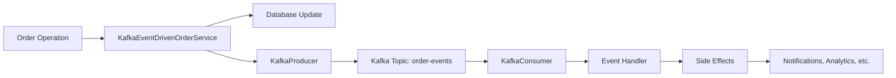

# Event-Driven Order Flow Implementation

## Overview

This document describes the **Kafka-only event-driven architecture** implementation for the order flow in the food delivery backend service. The implementation provides a **simple, scalable, and production-ready** solution for handling order-related operations through Kafka events.

## Architecture Components

### 1. Simplified Event Infrastructure (`shared/events/`)

#### Order Events (`order_event.go`)
- **OrderEvent Struct**: Simple event structure with JSON serialization
- **Event Type Constants**: All order-related event types
- **Helper Functions**: Factory methods for creating specific events
- **JSON Serialization**: Built-in ToJSON/FromJSON methods

```go
type OrderEvent struct {
    ID          string                 `json:"id"`
    Type        string                 `json:"type"`
    OrderID     string                 `json:"orderId"`
    UserID      string                 `json:"userId,omitempty"`
    Data        map[string]interface{} `json:"data"`
    OccurredAt  time.Time              `json:"occurredAt"`
    Version     string                 `json:"version"`
}
```

#### Kafka Integration (`kafka_event_bus.go`)
- **KafkaProducer**: Simple producer for publishing events
- **KafkaConsumer**: Simple consumer for receiving events
- **EventHandler**: Function type for handling events
- **Direct Sarama Integration**: No complex abstractions

### 2. Event Types

#### Supported Event Types
```go
const (
    OrderCreatedType           = "order.created"
    OrderStateChangedType      = "order.state_changed"
    OrderPaymentProcessedType  = "order.payment_processed"
    OrderShipperAssignedType   = "order.shipper_assigned"
    OrderCancelledType         = "order.cancelled"
    OrderDeliveredType         = "order.delivered"
)
```

#### Event Factory Functions
- **NewOrderCreatedEvent**: Creates order creation events
- **NewOrderStateChangedEvent**: Creates state transition events
- **NewOrderPaymentProcessedEvent**: Creates payment events
- **NewOrderShipperAssignedEvent**: Creates shipper assignment events
- **NewOrderCancelledEvent**: Creates cancellation events
- **NewOrderDeliveredEvent**: Creates delivery completion events

### 3. Event-Driven Service

#### Kafka Event-Driven Order Service (`kafka_event_driven_order_service.go`)
- **Wraps existing order operations** with Kafka event publishing
- **Maintains backward compatibility** with existing APIs
- **Automatic event generation** for all order operations
- **Graceful error handling** - operations don't fail if events fail

```go
type KafkaEventDrivenOrderService struct {
    createHandler *CreateCommandHandler
    stateHandler  *OrderStateManagementService
    producer      *events.KafkaProducer
}
```

## Event Flow Diagrams

### Simplified Kafka Event Flow


### Order Creation Flow
```
User Request → KafkaEventDrivenOrderService → Database + Kafka Event
                           ↓                         ↓
                    Order Created              order.created event
                                                      ↓
                                              External Consumers
```

### Order State Transition Flow
```
State Change → TransitionOrderState → Database + Kafka Event
                     ↓                        ↓
               State Updated            order.state_changed event
                                              ↓
                                      External Consumers
```

## Implementation Benefits

### 1. **Simplicity**

- **No complex abstractions** - Direct Kafka integration
- **Single responsibility** - Each component has one job
- **Easy to understand** - Straightforward producer/consumer pattern
- **Minimal dependencies** - Only Kafka and Sarama

### 2. **Kafka-Native Benefits**

- **Durability** - Events persisted in Kafka topics
- **Scalability** - Horizontal scaling through partitions
- **Fault tolerance** - Built-in replication and recovery
- **Ordering guarantees** - Per-partition message ordering

### 3. **Production Ready**

- **Battle-tested** - Kafka is proven at scale
- **Monitoring** - Rich ecosystem of monitoring tools
- **Operations** - Well-understood operational patterns
- **Performance** - High throughput and low latency

### 4. **Developer Experience**

- **Simple setup** - Just create producer/consumer
- **Type safety** - Strongly typed events
- **Easy testing** - Mock producers/consumers
- **Clear patterns** - Standard Kafka patterns

## Configuration

### Simple Kafka Setup
```go
// Create Kafka producer
brokers := []string{"localhost:9092"}
topic := "order-events"

producer, err := events.NewKafkaProducer(brokers, topic)
if err != nil {
    log.Fatalf("Failed to create Kafka producer: %v", err)
}
defer producer.Close()

// Create event-driven service
eventDrivenService := service.NewKafkaEventDrivenOrderService(
    createHandler,
    stateHandler,
    producer,
)
```

### Consumer Setup
```go
// Create Kafka consumer
consumer, err := events.NewKafkaConsumer(brokers, topic)
if err != nil {
    log.Fatalf("Failed to create Kafka consumer: %v", err)
}
defer consumer.Close()

// Define event handler
handler := func(event *events.OrderEvent) error {
    switch event.Type {
    case events.OrderCreatedType:
        // Handle order created
    case events.OrderStateChangedType:
        // Handle state change
    }
    return nil
}

// Start consuming
err = consumer.ConsumeEvents(handler)
```

## Event Schema

### Simplified OrderEvent Structure
```json
{
  "id": "550e8400-e29b-41d4-a716-446655440000",
  "type": "order.created",
  "orderId": "order-123",
  "userId": "user-456",
  "data": {
    "restaurantId": "restaurant-789",
    "totalPrice": 25.50,
    "orderDetails": [
      {
        "foodId": "food-001",
        "foodName": "Pizza Margherita",
        "price": 12.50,
        "quantity": 2,
        "discount": 0
      }
    ],
    "createdAt": "2024-01-01T12:00:00Z"
  },
  "occurredAt": "2024-01-01T12:00:00Z",
  "version": "1.0"
}
```

### OrderStateChangedEvent
```json
{
  "id": "550e8400-e29b-41d4-a716-446655440001",
  "type": "order.state_changed",
  "orderId": "order-123",
  "userId": "",
  "data": {
    "oldState": "waiting_for_shipper",
    "newState": "preparing",
    "updatedBy": "restaurant-789",
    "changedAt": "2024-01-01T12:05:00Z"
  },
  "occurredAt": "2024-01-01T12:05:00Z",
  "version": "1.0"
}
```

## Testing

### Unit Testing

- **Mock Kafka Producer**: Test event publishing without Kafka
- **Event Assertion Helpers**: Verify correct event creation
- **Service Testing**: Test order operations with mocked producer

```go
func TestOrderCreation(t *testing.T) {
    mockProducer := &MockKafkaProducer{}
    service := NewKafkaEventDrivenOrderService(createHandler, stateHandler, mockProducer)

    orderID, err := service.CreateOrder(ctx, orderData)

    assert.NoError(t, err)
    assert.Equal(t, 1, mockProducer.PublishedEventCount())
    assert.Equal(t, events.OrderCreatedType, mockProducer.LastEvent().Type)
}
```

### Integration Testing

- **Kafka Test Containers**: Use testcontainers for real Kafka testing
- **End-to-end Flow**: Test complete order flow with events
- **Consumer Testing**: Verify event consumption and handling

### Performance Testing

- **Kafka Throughput**: Measure event publishing rates
- **Consumer Lag**: Monitor consumer processing speed
- **Order Processing**: Benchmark complete order flows

## Monitoring and Observability

### Kafka-Native Monitoring

- **Kafka Metrics**: Built-in broker and topic metrics
- **Consumer Lag**: Monitor processing delays
- **Partition Distribution**: Ensure balanced load
- **Error Rates**: Track failed message processing

### Application Metrics

- **Event Publishing Success/Failure Rates**
- **Order Processing Times**
- **Event Handler Performance**
- **Business Metrics** (orders/minute, revenue, etc.)

### Logging

- **Structured Logging**: JSON format with correlation IDs
- **Event Tracing**: Track events through the system
- **Error Context**: Detailed error information
- **Performance Metrics**: Timing and throughput data

## Deployment Strategy

### Phase 1: Kafka Infrastructure

1. **Deploy Kafka Cluster**
   - Set up Kafka brokers
   - Configure topics and partitions
   - Set up monitoring

2. **Create Order Events Topic**
   ```bash
   kafka-topics --create --topic order-events --partitions 3 --replication-factor 1
   ```

### Phase 2: Event Publishing

1. **Deploy Event-Driven Service**
   - Update order module to use Kafka producer
   - Monitor event publishing
   - Verify event format and content

2. **Gradual Rollout**
   - Feature flag for event publishing
   - Monitor for any performance impact
   - Validate event data quality

### Phase 3: Event Consumers

1. **Deploy Event Consumers**
   - Notification service consumer
   - Analytics service consumer
   - Inventory service consumer

2. **Monitor Consumer Health**
   - Consumer lag monitoring
   - Error rate tracking
   - Processing time metrics

## Usage Examples

### Publishing Events (Automatic)

Events are automatically published when using the event-driven service:

```go
// This automatically publishes an OrderCreated event
orderID, err := eventDrivenService.CreateOrder(ctx, orderData)

// This automatically publishes OrderStateChanged event
err = eventDrivenService.TransitionOrderState(ctx, stateRequest)
```

### Consuming Events

```go
// See examples/kafka_consumer_example.go for complete example
consumer, err := events.NewKafkaConsumer(brokers, "order-events")
handler := func(event *events.OrderEvent) error {
    // Process the event
    return nil
}
err = consumer.ConsumeEvents(handler)
```

## Conclusion

The **simplified Kafka-only event-driven architecture** provides:

- **🎯 Simplicity**: No complex abstractions, just Kafka
- **🚀 Performance**: Native Kafka performance and scalability
- **🔧 Maintainability**: Easy to understand and modify
- **📊 Observability**: Rich Kafka ecosystem for monitoring
- **🏗️ Production Ready**: Battle-tested Kafka infrastructure

This architecture maintains **backward compatibility** while enabling **real-time event processing** for notifications, analytics, and other downstream services. The implementation is **focused, clean, and production-ready** with minimal complexity.
