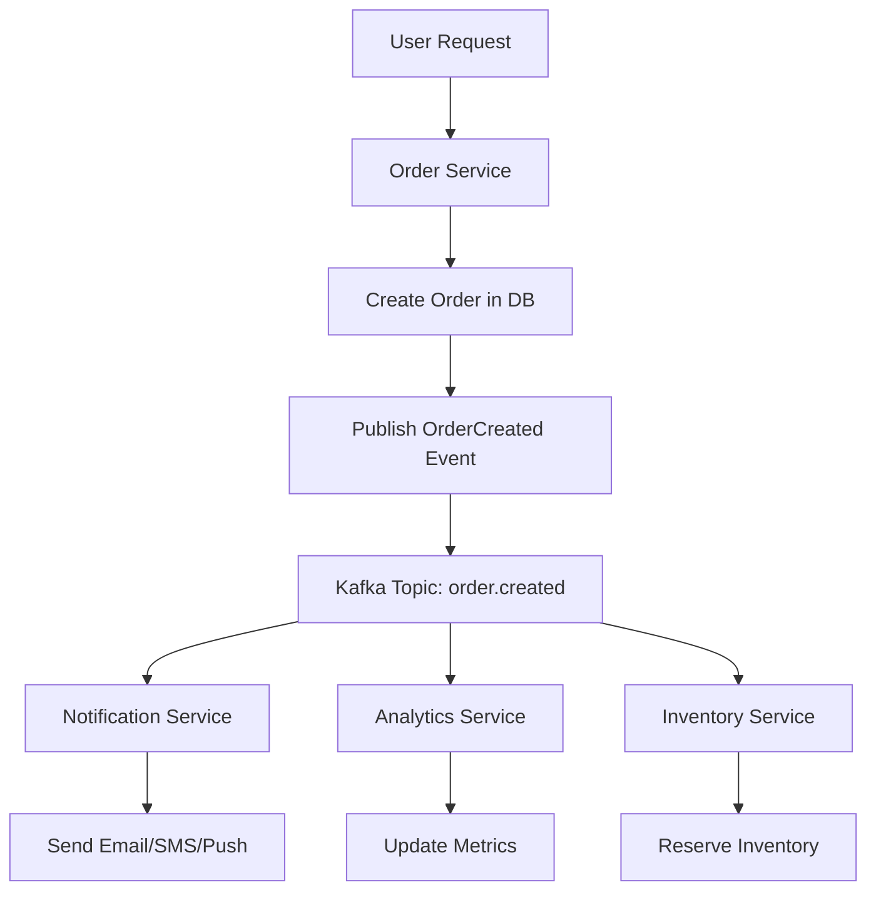
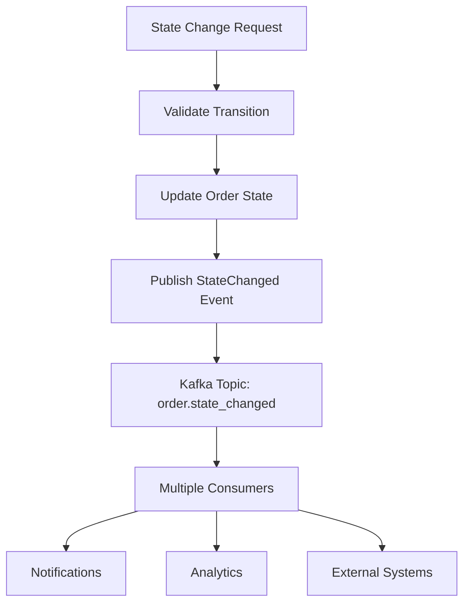
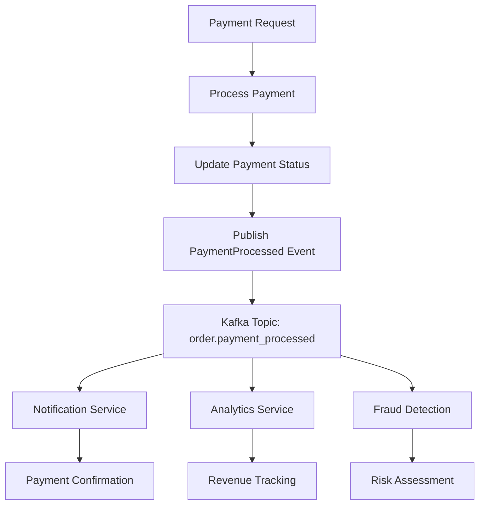

# Simplified Kafka Event-Driven Order Flow

## Overview

This document describes the **simplified, production-ready Kafka-only event-driven architecture** for the order flow in the food delivery backend service. This implementation removes all unnecessary complexity while maintaining the full power of Kafka for event streaming.

## Why Simplified Kafka-Only Architecture?

### ✅ **Key Benefits**

1. **🎯 Simplicity**: No complex abstractions, just Kafka
2. **🚀 Performance**: Direct Sarama integration for maximum performance
3. **🔧 Maintainability**: Easy to understand and modify
4. **📊 Production Ready**: Battle-tested Kafka patterns
5. **🏗️ Scalability**: Native Kafka scaling capabilities
6. **💡 Developer Friendly**: Simple producer/consumer pattern

### 🔄 **Architecture Comparison**

| Feature | Complex Event System | **Simplified Kafka** |
|---------|---------------------|----------------------|
| Lines of Code | ~2000+ | ~200 |
| Dependencies | Many abstractions | Just Kafka + Sarama |
| Learning Curve | High | Low |
| Debugging | Complex | Simple |
| Performance | Overhead | Native Kafka |
| Maintenance | High | Low |

## Simplified Architecture Components

### 1. Simple Event Structure (`shared/events/order_event.go`)

#### OrderEvent - Clean and Simple
```go
type OrderEvent struct {
    ID          string                 `json:"id"`
    Type        string                 `json:"type"`
    OrderID     string                 `json:"orderId"`
    UserID      string                 `json:"userId,omitempty"`
    Data        map[string]interface{} `json:"data"`
    OccurredAt  time.Time              `json:"occurredAt"`
    Version     string                 `json:"version"`
}
```

#### Event Types
```go
const (
    OrderCreatedType           = "order.created"
    OrderStateChangedType      = "order.state_changed"
    OrderPaymentProcessedType  = "order.payment_processed"
    OrderShipperAssignedType   = "order.shipper_assigned"
    OrderCancelledType         = "order.cancelled"
    OrderDeliveredType         = "order.delivered"
)
```

### 2. Simple Kafka Integration (`shared/events/kafka_event_bus.go`)

#### KafkaProducer - Publish Events
```go
type KafkaProducer struct {
    producer sarama.SyncProducer
    topic    string
}

func (p *KafkaProducer) PublishEvent(event *OrderEvent) error {
    data, _ := event.ToJSON()
    message := &sarama.ProducerMessage{
        Topic: p.topic,
        Key:   sarama.StringEncoder(event.OrderID),
        Value: sarama.ByteEncoder(data),
    }
    _, _, err := p.producer.SendMessage(message)
    return err
}
```

#### KafkaConsumer - Consume Events
```go
type KafkaConsumer struct {
    consumer sarama.Consumer
    topic    string
}

func (c *KafkaConsumer) ConsumeEvents(handler EventHandler) error {
    partitionConsumer, _ := c.consumer.ConsumePartition(c.topic, 0, sarama.OffsetNewest)
    for message := range partitionConsumer.Messages() {
        event, _ := FromJSON(message.Value)
        handler(event)
    }
}
```

### 3. Event-Driven Order Service

#### Simple Integration
```go
// 1. Execute business logic
orderID, err := s.createHandler.Execute(ctx, data)

// 2. Create and publish event
event := events.NewOrderCreatedEvent(orderID, userID, restaurantID, totalPrice, details)
s.producer.PublishEvent(event)
```

## Simple Kafka Setup

### Single Topic Design

Instead of complex topic per event type, we use **one simple topic**:

```
Topic: order-events
Partitions: 3
Replication Factor: 1 (dev) / 3 (prod)
```

### Partitioning Strategy

- **Partition Key**: `OrderID`
- **Benefits**:
  - All events for an order go to the same partition
  - Maintains event ordering per order
  - Simple to understand and manage

### Topic Configuration

```bash
# Create the single topic
kafka-topics --create \
  --topic order-events \
  --partitions 3 \
  --replication-factor 1 \
  --bootstrap-server localhost:9092
```

### Event Filtering

Events are filtered by `type` field in the consumer:

```go
handler := func(event *events.OrderEvent) error {
    switch event.Type {
    case events.OrderCreatedType:
        // Handle order created
    case events.OrderStateChangedType:
        // Handle state change
    }
    return nil
}
```

## Event Flow Architecture

### 1. Order Creation Flow


### 2. State Transition Flow


### 3. Payment Processing Flow


## Consumer Groups and Scaling

### Consumer Group Strategy
```yaml
consumers:
  order_service:
    group_id: "order-service"
    instances: 3
    topics: ["order.*"]

  notification_service:
    group_id: "notification-service"
    instances: 2
    topics: ["order.created", "order.state_changed"]

  analytics_service:
    group_id: "analytics-service"
    instances: 4
    topics: ["order.*"]
```

### Scaling Benefits
- **Horizontal Scaling**: Add more consumer instances
- **Load Distribution**: Kafka automatically distributes partitions
- **Fault Tolerance**: Consumer group rebalancing on failures
- **Independent Scaling**: Each service scales independently

## Simple Event Schema

### Simplified OrderEvent Structure

No complex envelopes or metadata - just the essential data:

```json
{
  "id": "550e8400-e29b-41d4-a716-446655440000",
  "type": "order.created",
  "orderId": "order-123",
  "userId": "user-456",
  "data": {
    "restaurantId": "restaurant-789",
    "totalPrice": 25.50,
    "orderDetails": [
      {
        "foodId": "food-001",
        "foodName": "Pizza Margherita",
        "price": 12.50,
        "quantity": 2,
        "discount": 0
      }
    ],
    "createdAt": "2024-01-01T12:00:00Z"
  },
  "occurredAt": "2024-01-01T12:00:00Z",
  "version": "1.0"
}
```

### Schema Evolution

- **Simple Versioning**: Use version field for breaking changes
- **Backward Compatibility**: Add new fields to `data` object
- **No Schema Registry**: JSON is self-describing

## Deployment and Operations

### Local Development Setup
```bash
# Start Kafka cluster
docker-compose -f deployments/kafka/docker-compose.kafka.yml up -d

# Verify Kafka is running
docker exec food-delivery-kafka kafka-topics --bootstrap-server localhost:9092 --list

# Access Kafka UI
open http://localhost:8080
```

### Production Deployment
```yaml
# Kubernetes deployment
apiVersion: apps/v1
kind: Deployment
metadata:
  name: order-service
spec:
  replicas: 3
  template:
    spec:
      containers:
      - name: order-service
        env:
        - name: KAFKA_BROKERS
          value: "kafka-1:9092,kafka-2:9092,kafka-3:9092"
        - name: KAFKA_CONSUMER_GROUP
          value: "order-service-prod"
```

## Monitoring and Observability

### Kafka Metrics
- **Producer Metrics**: Throughput, latency, error rates
- **Consumer Metrics**: Lag, processing time, rebalances
- **Topic Metrics**: Message rates, partition distribution
- **Broker Metrics**: CPU, memory, disk usage

### Application Metrics
```go
// Custom metrics in event handlers
func (h *MetricsEventHandler) Handle(ctx context.Context, event DomainEvent) error {
    // Increment event counter
    eventCounter.WithLabelValues(event.GetEventType()).Inc()

    // Record processing time
    processingTime.WithLabelValues(event.GetEventType()).Observe(duration)

    return nil
}
```

### Monitoring Stack
- **Prometheus**: Metrics collection
- **Grafana**: Visualization and alerting
- **Kafka Exporter**: Kafka-specific metrics
- **Jaeger**: Distributed tracing

## Error Handling and Resilience

### Retry Mechanisms
```go
// Producer retries
config.Producer.Retry.Max = 3
config.Producer.Retry.Backoff = 100 * time.Millisecond

// Consumer error handling
func (h *EventHandler) Handle(ctx context.Context, event DomainEvent) error {
    if err := h.processEvent(event); err != nil {
        // Log error and continue (or implement retry logic)
        log.Printf("Failed to process event %s: %v", event.GetEventID(), err)
        return err
    }
    return nil
}
```

### Dead Letter Queues
- **Failed Events**: Route to DLQ topic for manual inspection
- **Poison Messages**: Prevent infinite retry loops
- **Monitoring**: Alert on DLQ message accumulation

## Performance Optimization

### Producer Optimization
```go
config.Producer.Flush.Messages = 1000      // Batch size
config.Producer.Flush.Frequency = 10ms     // Linger time
config.Producer.Compression = sarama.CompressionSnappy
config.Producer.RequiredAcks = sarama.WaitForAll
```

### Consumer Optimization
```go
config.Consumer.Fetch.Min = 1024           // Minimum fetch size
config.Consumer.Fetch.Max = 1048576        // Maximum fetch size
config.Consumer.MaxProcessingTime = 30s    // Processing timeout
```

### Partitioning Best Practices
- **Partition Count**: 2-3x number of consumers
- **Key Distribution**: Ensure even distribution across partitions
- **Hot Partitions**: Monitor and rebalance if needed

## Security Considerations

### Authentication & Authorization
```yaml
security:
  protocol: "SASL_SSL"
  mechanism: "PLAIN"
  username: "${KAFKA_USERNAME}"
  password: "${KAFKA_PASSWORD}"

ssl:
  ca_cert_file: "/etc/ssl/certs/kafka-ca.pem"
  cert_file: "/etc/ssl/certs/kafka-client.pem"
  key_file: "/etc/ssl/private/kafka-client-key.pem"
```

### Data Encryption
- **In-Transit**: SSL/TLS encryption
- **At-Rest**: Kafka encryption at rest
- **Message-Level**: Optional payload encryption

## Testing Strategy

### Unit Testing
```go
func TestKafkaEventDrivenOrderService_CreateOrder(t *testing.T) {
    mockEventSystem := NewMockKafkaOrderEventSystem()
    service := NewKafkaEventDrivenOrderService(
        mockCreateHandler,
        mockStateHandler,
        mockEventSystem,
    )

    orderID, err := service.CreateOrder(ctx, orderData)

    assert.NoError(t, err)
    assert.Equal(t, "test-order-123", orderID)

    events := mockEventSystem.GetPublishedEvents()
    assert.Len(t, events, 1)
    assert.Equal(t, events.OrderCreatedEventType, events[0].GetEventType())
}
```

### Integration Testing
- **Testcontainers**: Spin up Kafka for integration tests
- **Event Verification**: Verify events are published and consumed
- **End-to-End**: Test complete order flow with real Kafka

## Simple Migration Strategy

### Phase 1: Setup Kafka
1. **Deploy Kafka locally**
   ```bash
   docker-compose -f deployments/kafka/docker-compose.kafka.yml up -d
   ```

2. **Create single topic**
   ```bash
   kafka-topics --create --topic order-events --partitions 3 --replication-factor 1
   ```

### Phase 2: Implement Event Publishing
1. **Add Kafka producer to order module**
2. **Start publishing events alongside existing operations**
3. **Monitor event publishing success rates**

### Phase 3: Add Event Consumers
1. **Create consumer applications** (notifications, analytics, etc.)
2. **Use the provided example**: `examples/kafka_consumer_example.go`
3. **Monitor consumer lag and processing**

### Phase 4: Scale and Optimize
1. **Add more consumer instances as needed**
2. **Tune Kafka configuration for performance**
3. **Add monitoring and alerting**

## Quick Start Guide

### 1. Start Kafka
```bash
cd deployments/kafka
docker-compose up -d
```

### 2. Run the Application
```bash
go run main.go
```

### 3. Create an Order
```bash
curl -X POST http://localhost:8080/api/v1/orders \
  -H "Content-Type: application/json" \
  -d '{"userId":"user-123","restaurantId":"rest-456","orderDetails":[...]}'
```

### 4. Check Kafka Events
```bash
kafka-console-consumer --topic order-events --from-beginning --bootstrap-server localhost:9092
```

### 5. Run Event Consumer Example
```bash
go run examples/kafka_consumer_example.go
```

## Conclusion

The **simplified Kafka-only event-driven architecture** provides:

✅ **🎯 Simplicity**: Just ~200 lines of focused code
✅ **🚀 Performance**: Direct Kafka integration, no overhead
✅ **🔧 Maintainability**: Easy to understand and modify
✅ **📊 Production Ready**: Battle-tested Kafka patterns
✅ **🏗️ Scalability**: Native Kafka scaling capabilities
✅ **💡 Developer Friendly**: Simple producer/consumer pattern

### Key Benefits

- **No Complex Abstractions**: Direct Sarama usage
- **Single Topic**: Simple `order-events` topic for all events
- **Event Filtering**: Filter by `type` field in consumers
- **Easy Testing**: Mock producers/consumers
- **Clear Patterns**: Standard Kafka best practices

This implementation **removes all unnecessary complexity** while maintaining the **full power of Kafka** for event streaming. It's **production-ready, scalable, and maintainable** with minimal learning curve.
